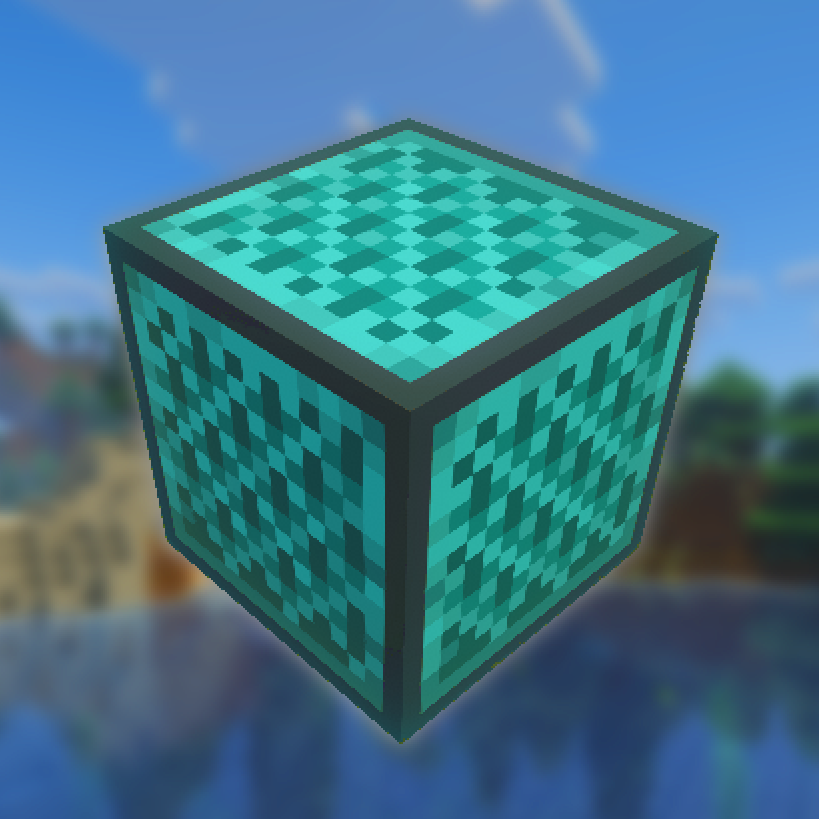

<h1 align="center">Better Note Blocks 

 

  
</h1>

<b>Better Note Blocks</b> adds 15 new note block colors, tons of new instruments, and quality-of-life improvements.

---

## Features

* **20+ New Instruments:** A massive expansion packed with brand-new sounds!
* **Drums & Percussion:** Huge variety of percussion!
* **Sustained Synths:** Unique synths with an extended pitch range for leads and basslines!

* **Optional Note Overlay:** Includes a built in resourcepack with visual indicators to see exactly what note your
  blocks are tuned to
  (Also toggleable via `/togglenoteblockoverlay`).
* **Backwards Tuning:** Hold Shift and right-click to tune blocks backwards.
* **Easy copying:** Middle-click to copy a note block without resetting its pitch.

## Recommended Mod

* **Create: Sound of Steam:** Includes a tracker bar block that can play MIDI files using redstone links.

Using this together with Better Note Blocks lets you play any MIDI file!

## Instrument List

| Block                       | Instrument            | Range     |
|:----------------------------|:----------------------|:----------|
| **Amethyst Block**          | Music Box             | F#4 - F#6 |
| **Redstone Ore**            | Electric Guitar       | F#3 - F#5 |
| **Black Stained Glass**     | Hi-Hat                | F#3 - F#5 |
| **Obsidian**                | Synth Stab            | F#3 - F#5 |
| **Deepslate**               | Kick Stomp            | F#2 - F#4 |
| **Gilded Blackstone**       | Orchestral Hit        | F#4 - F#6 |
| **Netherite Block**         | Metal Pipe            | F#4 - F#6 |
| **Sandstone Block**         | Brawl Kick            | F#2 - F#4 |
| **Raw Copper Block**        | Crash                 | F#1 - F#3 |
| **Beehive**                 | Acoustic Tom          | F#1 - F#3 |
| **Cauldron**                | Holy Choir            | F#4 - F#6 |
| **Composter**               | Wood Block            | F#2 - F#4 |
| **Polished Basalt**         | Hardstyle Kick        | F#1 - F#3 |
| **Diamond Block**           | Triangle              | F#6 - F#8 |
| **Reinforced Deepslate**    | Synth Bass            | F#0 - F#2 |
| **Lodestone**               | Timpani               | F#1 - F#3 |
| **Chiseled Stone Bricks**   | Aztek Psy Drum        | F#3 - F#5 |
| **Wet Sponge**              | Bloop Noise           | F#3 - F#5 |
| **Red Sand**                | Snare                 | F#3 - F#5 |
| **Sea Lantern**             | Kalimba               | F#2 - F#4 |
| **Calcite**                 | Finger Snap           | F#5 - F#7 |
| **Gravel**                  | Classic Clap          | F#3 - F#5 |
| **Ochre Froglight**         | Bongo                 | F#2 - F#4 |
| **Loom**                    | Afro Harp             | F#2 - F#4 |
| **White Glazed Terracotta** | Phonk Cowbell Crystal | F#4 - F#6 |
| **Brewing Stand**           | Tambourine            | F#6 - F#8 |
| **Raw Gold Block**          | Gong                  | F#2 - F#4 |

### Sustained Synths

| Block               | Instrument        | Range      |
|:--------------------|:------------------|:-----------|
| **Red Concrete**    | Sawtooth Synth    | F#-1 - F#9 |
| **Orange Concrete** | Electone Trombone | F#-1 - F#9 |
| **Yellow Concrete** | GB_SQR Synth      | F#-1 - F#9 |
| **Lime Concrete**   | GB_SAW Synth      | F#-1 - F#9 |

### Synth information

* Synths Are capable of producing notes from F#-1 to F#9.
  To pitch synths up or down you need to place one of the following blocks underneath the concrete:

| Block                       | Range      |
|:----------------------------|:-----------|
| **Red Wool**                | F#-1 - F#1 |
| **Orange Wool**             | F#1 - F#3  |
| **Nothing (just concrete)** | F#3 - F#5  |
| **Green Wool**              | F#5 - F#7  |
| **Lime Wool**               | F#7 - F#9  | 

### Modded Sounds / Blocks

| Mod  | Block          | Instrument | Range       |
|:-----|:---------------|:-----------|:------------|
| Baba | **Baba Block** | Ba         | F#BA - F#BA |

---

## Requirements

| Dependency    | Version |
|:--------------|:--------|
| **Minecraft** | 1.20.1  |
| **Forge**     | 47.2.0+ |

---

  <b>Developed by Koentje</b> 

